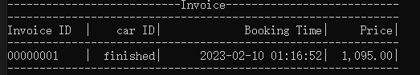

# Used Vehicle Invocing System Functions Doc

## 1. FileHandler

### Read :

```c++
#include "FileHandler.h"
```

1. Read everything in the csv file as an array.

```c++
vector<string> read_csv(const string& filename,bool keep_header = false)
```

```c++
vector<string> data = read_csv("carlist.csv");
cout << data[0] << endl;
```


2. Read everything in the csv file as a two-dimensional array

```c++
vector<vector<string>> read_csv_2D(const string& filename, bool keep_header = false)
```

```c++
vector<vector<string>> data = read_csv_2D("carlist.csv");
cout << data[0][0] << endl;
```


3. Read specific lines / line in the csv file.

```c++
vector<vector<string>> get_lines( const string& filename, int start, int range )
```

```c++
vector<vector<string>> data = get_lines("carlist.csv", 0, 2);
cout << data[0][0] << endl;
```


```c++
vector<string> get_line(const string& filename, int line)
```

```c++
vector<string> data = get_line("carlist.csv", 1);
cout << data[2] << endl;
```


4. Read specific columns / column in the csv file.

```c++
vector<vector<string>> get_cols( const string& filename, int start, int range )
```

```c++
vector<vector<string>> data = get_cols("carlist.csv", 0, 2);
cout << data[7][1] << endl;
```


```c++
vector<string> get_col(const string& filename, int col)
```

```c++
vector<string> data = get_col("carlist.csv", 0);
cout << data[0][0] << endl;
```


5. Read specific columns in the csv file.

```c++
string get_cell(const string& filename, int line, int col)
```

```c++
string data = get_cell("carlist.csv", 1, 2);
cout << data << endl;
```


#### Write :

1. Append data to the end of the csv file.

```c++
bool append_line(const string& filename, vector<string> data)
```

```c++
vector<string> data = { "1", "2", "3" };
bool res = append_line("carlist.csv", data);
cout << res;
```


2. Upload line to the csv file.

```c++
bool update_line(const string& filename, vector<string> data, int line)
```

```c++
vector<string> data = { "1", "2", "3" };
bool res = update_line("carlist.csv", data, 0);
cout << res;
```


3. Delete the original data in the csv file.

```c++
bool delete_line(const string& filename, int line, int range =1 )
```

```c++
bool res = delete_line("carlist.csv", 0);
cout << res;
```


4. Write data to specific cells.

```c++
bool update_cell(const string& filename, string value, int line, int row)
```

```c++
bool res = update_cell("carlist.csv", "666", 0, 0);
cout << res;
```


#### Sort:

- [ ] A. Sort the data in the csv file by row in ascending order.
- [ ] B. Sort the data in the csv file by row in descending order.

#### Inquiry:

```c++
vector<int> query(const string& filename, string condition[])
```

```c++
string condition[] = { "Registration Date", "==", "2007" };
vector<int> res = query("carlist.csv", condition);
cout << res.size() << endl;
```


## 2.Authentication

```c++
#include "Authentication.h"
```

```c++
#define USER_FILE "users.csv"
#define USER_Name_ROW 0
#define USER_Password_ROW 2
#include "FileHandler.h"
```

```c++
/// <summary>
/// user login function
/// </summary>
/// <param name="username"></param>
/// <param name="password"></param>
/// <returns>
/// 100 success 
/// 200 can't find user
/// 300 password incorrect
/// 400 unknown error
///</returns>
int login(string username, string password)
```


## 3.Console

```c++
#include "Console.h"
```


```c++
void Console::error(string message)
```

```c++
void Console::success(string message)
```

```c++
void Console::warning(string message) 
```


## 4.DateTime

```c++
#include "DateTime.h"
```

```c++
cont << get_now() << endl;

// 2023-02-10 00:46:44
```


## 5.Form

```c++
#define SIGN "-"
// Sign used to orm the divider

int show_invoice(vector<string> data){
    int len = 61;
    // The length of this form
    string divider = "";
    for (int i = 0; i < len; i++)
    {
        divider += SIGN;
    }

    cout << center_print("Receipt", SIGN, len) << endl;
    
    cout << divider << endl;
    cout << setiosflags(ios::left) 
        << setw(12) << "Invoice ID" << "|" 
        << resetiosflags(ios::left)
        << setiosflags(ios::right) 
        << setw(10) << "car ID" << "|" 
        << setw(25) << "Booking Time" << "|"
        << setw(10) << "Price" << "|"  
        << resetiosflags(ios::right) << endl;
    
    cout << divider << endl;
    cout << setiosflags(ios::left)
        << setw(12) << data[0] << "|"
        << resetiosflags(ios::left)
        << setiosflags(ios::right)
        << setw(10) << data[1] << "|"
        << setw(25) << data[2] << "|"
        << setw(10) << data[3] << "|"
        << resetiosflags(ios::right) << endl;
    cout << divider << endl;
    return 1;
}

```




## 6.Number

```c++
string number_to_string(int number)
```

```c++
int string_to_number(string str)
```


## 7.String

```c++
std::string zfill(std::string data, int length, char fill = '0')
```

```c++
std::string zfill(int data, int length, char fill = '0') 
```

```c++
string trade_id = zfill(1, 8);
cout << trade_id << endl;

// 00000001
```


```c++
string toLowerCase(string str)
```


## 8.User

```c++
class User {
public:
	string username = "unknown";
	string role = "saleperson";
	string password = "unknown";
	string phone =  "unknown";
	int login_status;
	User(string username, string password);
	void init_user();
};
```


## 9.Status Container

 ```c++
 #include "User.h"
 
 class StatusContainer
 {
 public:static User current_user;
 };
 
 User StatusContainer::current_user = User("unknown", "unknown");
 ```

